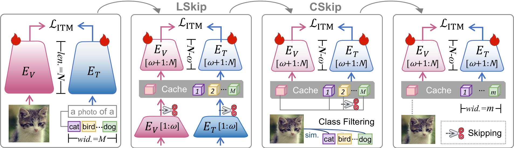
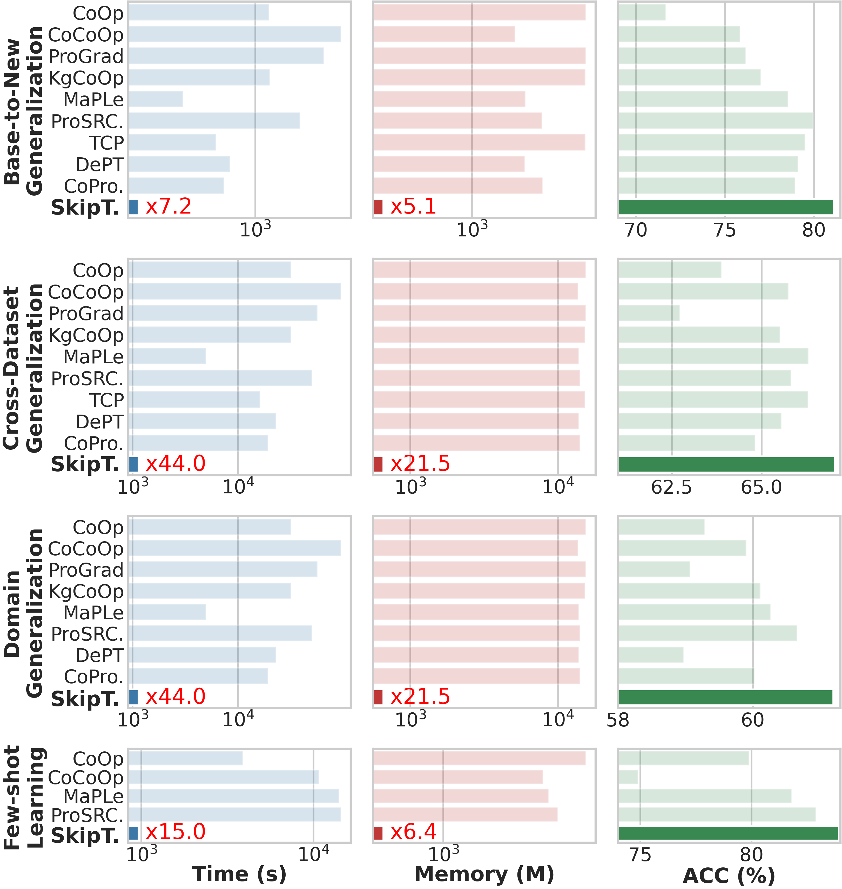
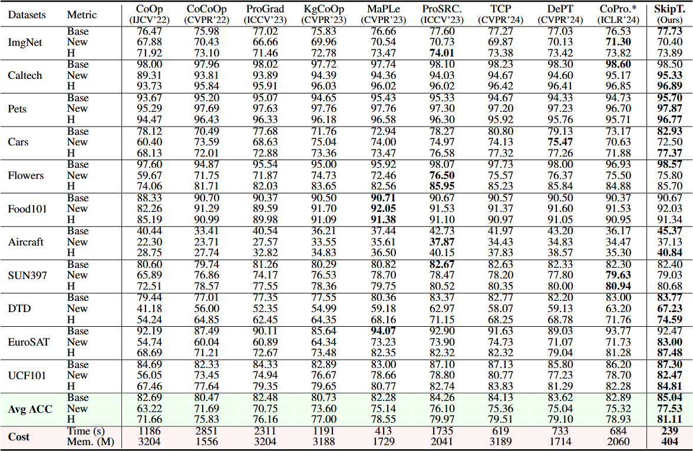
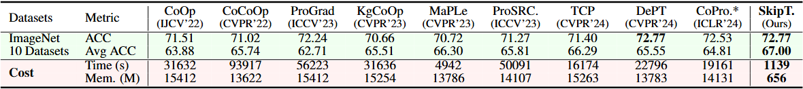
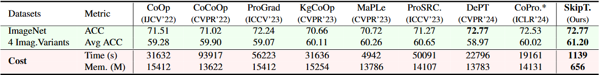
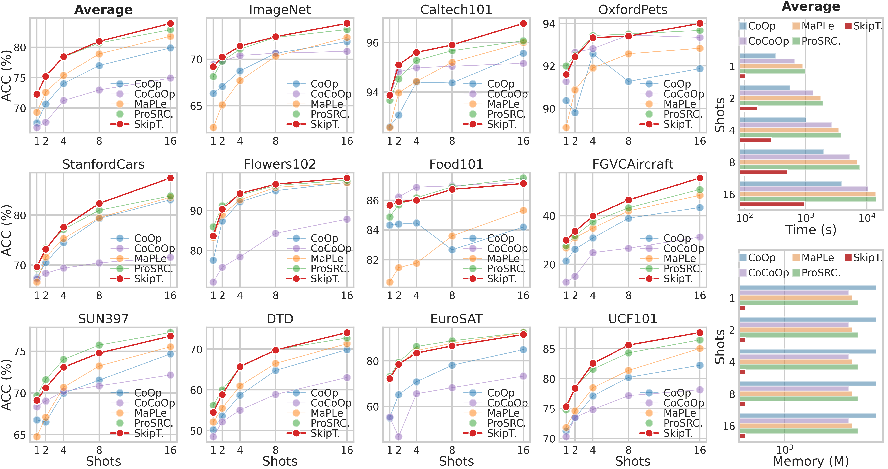

# Skip Tuning: Pre-trained Vision-Language Models are Effective and Efficient Adapters Themselves

Offical implementation of the paper "Skip Tuning: Pre-trained Vision-Language Models are Effective and Efficient Adapters Themselves".

----

# News

- (Nov. 14, 2024) Training and evaluation codes for SkipTuning are released.

----

# Highlights

> **Abstract** Prompt Tuning (PT) aims to transfer large pre-trained vision-language models (VLMs) to downstream tasks by learning a tiny set of context vectors. 
> Despite significant progress,  we reveal in this work that freezing the parameters of VLMs during learning the context vectors neither facilitates the transferability of pre-trained knowledge nor improves the memory and time efficiency considerably. Upon further investigation, we find that reducing both the length and width of the feature-gradient propagation flows in the full fine-tuning (FT) baseline is key to achieving effective and efficient knowledge transfer.  Motivated by this, we propose Skip Tuning, a novel paradigm for adapting VLMs to downstream tasks without relying extra context vectors or adapter modules. Concretely, Skip Tuning performs Layer-wise Skipping (LSkip) and Class-wise Skipping (CSkip) to reduce both memory usage and time cost while maintaining FT performance. Extensive experiments on a wide spectrum of benchmarks demonstrate the effectiveness and efficiency of Skip Tuning, e.g., on the few-shot learning benchmark, our Skip Tuning achieves $\underline{\times \textbf{15}}$ time efficiency, $\underline{\times \textbf{6.4}}$ memory efficiency, while yielding a $\underline{\textbf{1.04}}\%$ ACC improvement over the previous SOTA.



----

# Main Contributions

> 1. We reveal that reducing both the width and length of the feature-gradient propagation flows (FGPFs) of the full fine-tuning (FT) baseline is key to establishing effective and efficient knowledge transfer.
> 
> 2. We devise Skip Tuning, an effective and efficient method for transferring VLMs to downstream tasks without relying on extra context vectors or adapter modules.
> 
> 3. We evaluate our method on a wide spectrum of benchmarks, demonstrating the superiority of Skip Tuning over prompt tuning and adapter tuning approaches.

----

# Efficiency and Effectiveness

Our SkipTuning is orthogonal to both prompt tuning and adapter tuning approaches, therefore can be used as a plugin to improve all of them.



**Base-to-New Generalization Performance**



**Cross-Dataset Generalization Performance**



**Domain Generalization Performance**



**Few-shot Learning Performance**



----

# Installation

This codebase is tested on Ubuntu 20.04.2 LTS with python 3.8. Follow the below steps to create environment and install dependencies.

Setup conda environment (recommended).

**Create a conda environment**

```
conda create -y -n skip python=3.8
conda activate skip
```

**Install torch (requires version >= 1.8.1) and torchvision**

```
pip install torch==1.9.0+cu111 torchvision==0.10.0+cu111 torchaudio==0.9.0 -f https://download.pytorch.org/whl/torch_stable.html
```

**Install dassl**

```
git clone https://github.com/KaiyangZhou/Dassl.pytorch.git
cd Dassl.pytorch/
pip install -r requirements.txt
python setup.py develop
```

**Install SkipTuning**

```
cd ..

git clone https://our_link.com/SkipTuning.git
cd SkipTuning/

pip install -r requirements.txt
pip install setuptools==59.5.0
```

----

# Data preparation

Please follow the instructions at [DATASETS.md](datasets/DATASETS.md) to prepare all datasets.

----

# Training and Evaluation

We provide parallel running script `parallel_runner.py` for each prompting variant including CoOp, CoCoOp, ProGrad, KgCoOp, MaPLe, PromptSRC, TCP, DePT and CoPrompt, and adapter-based variant CLIP-adapter. 

**Configure the paths in `configs.py`**

```python
base = dict(
    # dataset configs
    data = dict(
        root='your/data/root/here',
        ...
    ),

    # mail configs
    mail = dict(
        username='your@mail.com',
        password='your_mail_password_here',
        host='your.host.com',
        to='your@mail.com',
    ),

    # output configs
    output = dict(
        root='your/output/dir',
        result='your/result/acc/dir',
        cost='your/result/cost/dir',
        remove_dirs=['dirs removed before running'],
    ),
```

**Configure tasks in `config.py`**

```python
pipeline = [
    # pipelines will be run in parallel
    # Pipeline 1
    dict(
        # GPUs for this pipeline
        gpu_ids=[0, 1, 2], 
        # tasks in this pipeline will be run sequentially
        tasks=[
            'coop',
            'ft_clip',
            'skip_tuning',
        ]
    ),
    # Pipeline 2
    dict(
        gpu_ids=[3, 4, 5],
        tasks=[
            'skip_tuning',
        ]
    )
]
```

After running, the output will be in `your/output/dir`, results including accuracy and cost will be in `your/result/acc/dir` and `your/result/cost/dir`, a summary will be sent to `your@mail.com`.

If you want to add your own models, you'll need to write your models in the `trainers/` directory and register them in dassl, then configure the settings in the `configs/` directory and `configs.py` file. Then you can run `python parallel_runner.py` to run our own model.

----

# Acknowledgements

Our code is based on [Dassl.pytorch](https://github.com/KaiyangZhou/Dassl.pytorch) and [DePT](https://github.com/Koorye/DePT) repositories. We thank the authors for releasing their code. If you use our model and code, please consider citing these works as well.
